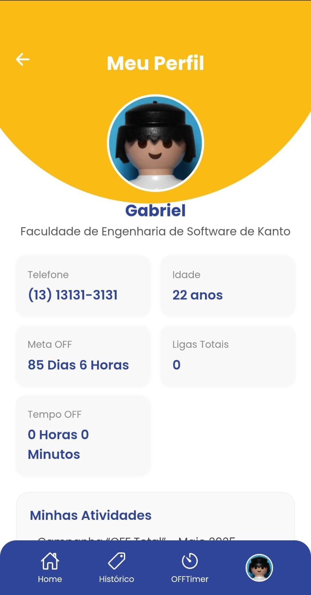
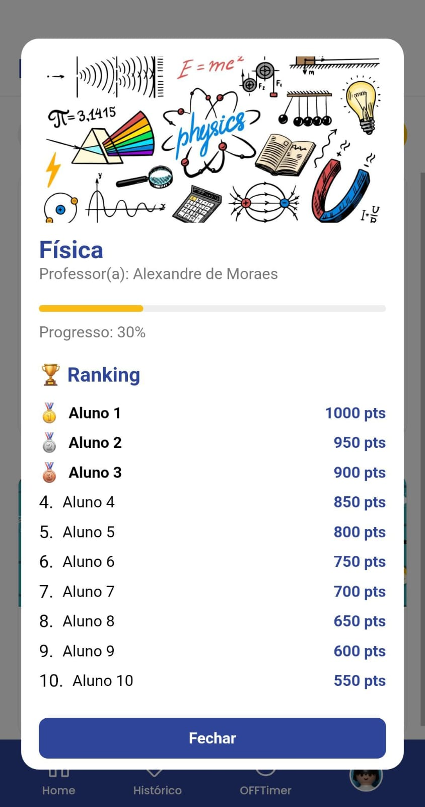

# 📱 OffClass

## 🚀 Uma nova forma de desconectar para se reconectar!

O **OffClass** é um aplicativo desenvolvido com o propósito de ajudar jovens com **Dependência de Internet (DI)** dentro de ambientes educacionais, como escolas e universidades.

Por meio de um sistema gamificado, o OffClass incentiva alunos a realizarem atividades offline, se desconectarem de forma consciente e melhorarem sua relação com a tecnologia, tudo isso com o acompanhamento de professores e recompensas motivadoras.

Este aplicativo foi desenvolvido como projeto final para a disciplina de **Tópicos Integrados**, funcionando como um **TCC prático**.

---

## 🎯 Funcionalidades

- ✅ Login como **Aluno (DI)** ou **Professor/Usuário comum**;
- ✅ **Atividades offline** publicadas por professores e comunidade;
- ✅ Sistema de **validação por fotos** das atividades realizadas;
- ✅ **Temporizador de tempo "Off"**, registrando o tempo desconectado;
- ✅ **Rankings e Recompensas** para quem mais se engaja no offline;
- ✅ **Perfil completo**, com histórico de atividades, evolução e pontuação;
- ✅ Interface simples, intuitiva e pensada para o ambiente educacional.

---

## 🧠 Como funciona?

1. 👤 **Crie sua conta:** como aluno com dependência digital ou como professor/usuário da instituição.
2. 📋 **Veja as atividades:** acesse a lista de atividades offline propostas.
3. 🧠 **Escolha uma atividade:** se voluntarie e realize ela no mundo real.
4. 📸 **Comprove:** envie uma foto como evidência de que realizou.
5. ⏳ **Ative o Temporizador:** registre o tempo que ficou longe do celular.
6. 🏆 **Ganhe pontos:** acumule pontos por atividades e tempo offline.
7. 🏅 **Suba no Ranking:** acompanhe seu progresso e veja sua evolução.

---

## 📸 Screenshots

Adicione aqui prints do seu aplicativo:

---

## 📲 Instalação e uso

O app está hospedado na plataforma **Expo**, o que permite testar facilmente em qualquer smartphone Android ou iOS.

### ✅ **Passo a passo:**

1. Acesse o link do app no Expo:  
👉 [**Link do app no Expo**](https://offclass.expo.app/)

2. Caso ainda não tenha, instale o aplicativo **Expo Go** no seu celular:  
- [Expo Go para Android](Em Breve)  
- [Expo Go para iOS](Em Breve)

3. Abra o **Expo Go**, escaneie o QR Code disponível no link do app ou clique diretamente no link se estiver no celular.

4. Pronto! O OffClass será carregado no seu dispositivo e estará pronto para uso.

---

## 💻 Tecnologias utilizadas

- 🟨 **React Native c/ Expo**  
- 🟦 **JavaScript**  
- 🎨 **CSS + Styled Components (ou outro sistema de estilização que você usou)**  
- 🔗 **Node.js**   
- 🗄️ **MySQL**   

*(Adapte aqui com as tecnologias que você realmente utilizou)*

---

## 🎓 Sobre o projeto

> Este projeto foi desenvolvido como parte da disciplina de **Tópicos Integrados**, funcionando como um **TCC prático**, na intenção de criar uma solução real para um problema social crescente: a dependência digital entre jovens estudantes.

O OffClass vai além de um simples aplicativo — ele propõe uma mudança de comportamento, promovendo o equilíbrio entre o mundo online e offline dentro do ambiente educacional.

---

## ❤️ Contribuição

Este projeto é acadêmico, mas tem grande potencial de expansão. Se você deseja contribuir com ideias, melhorias ou desenvolvimento, fique à vontade para abrir uma **Issue** ou um **Pull Request**.

---

## 📞 Contato

- 👨‍💻 Desenvolvedor: João Gabriel Ferreira Mendes  
- 📧 Email: [bielgagg94@gmail.com]  
- 🔗 LinkedIn: [www.linkedin.com/in/joao-gabriel-f-24343a270]  

---

## 📝 Licença

Este projeto está sob a licença **MIT** – veja o arquivo [LICENSE](LICENSE) para mais detalhes.

---

**Desconecte-se. Reconecte-se. Viva mais o agora.**  
✨ **OffClass – Menos Telas, Mais Vitorias.**
